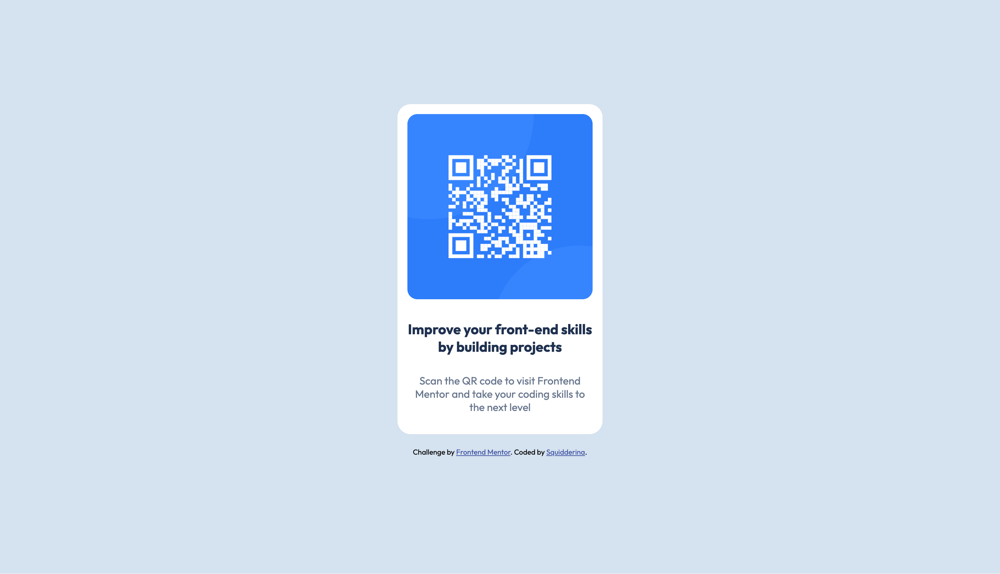

# Frontend Mentor - QR code component solution

This is a solution to the [QR code component challenge on Frontend Mentor](https://www.frontendmentor.io/challenges/qr-code-component-iux_sIO_H).

## Table of contents

- [Overview](#overview)
  - [Screenshot](#screenshot)
  - [Links](#links)
  - [Built with](#built-with)
  - [What I learned](#what-i-learned)
  - [Continued development](#continued-development)

## Overview

The goal of this project was to build and style a pre-designed QR code card on a mobile and desktop friendly page using HTML and CSS. The biggest challenge for me at my current level was positioning the card correctly on the page and making the elements responsive. With some research I found a method that mostly worked although I suspect there are cleaner ways which I will soon learn.

### Screenshot

### Links

- Live Site URL: [https://squidsplishsplash.github.io/fem-qrcode/]

### Built with

- Semantic HTML5 markup
- CSS custom properties

### What I learned

I learned some responsive design techniques ie. growing and shrinking font sizes, images, and containers.
Some lines that use this knowledge:

h4 {
    font-size: calc(15px + 0.4vw);
}

p {
    font-size: calc(13px + 0.2vw);
}

div.card {
    max-width: 280px;
}

img.qr {
    width: 100%;
}

I learned various ways to center elements horizontally and vertically on a page using padding in a container, margin: auto, and text-align: center. 

I also came to better understand how to choose class names and selectors to make my code more readable and efficient.

### Continued development

While I learned a lot on these topics I need more practise with them to better understand what works, why, and when. My project is not yet totally responsive but I am leaving it for now and may revisit when I learn more.
